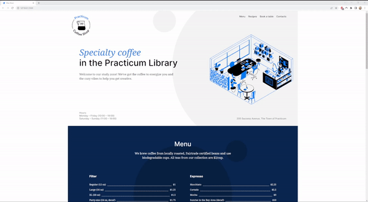

# Practicum Coffee Shop

This is the second project of the Web Development program at Practicum. It was created using HTML and CSS, based on the design brief.

## Project features

- Semantic HTML5
- Flexbox
- Positioning
- Flat BEM
- A custom form
- CSS animation and transform

## Take a look

## Plan on improving the project

- One idea that would be interesting to implement would be to create a hover state on the menu section for each of the menu items that would show the nutritional values of the hovered menu item.
